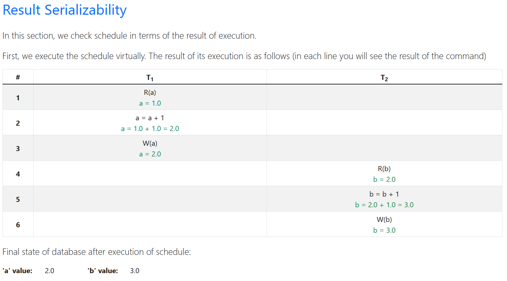

# Database Serializability

In this program, an execution plan of transactions is received as input, and it is examined in terms of 
different database serializability types, including **results**, **view**, and **conflict** serializability. 
In this analysis, the input plan will be validated in terms of syntax rules. Next, after ensuring the correctness
of the input plan, the plan will be displayed in a graphic format, and different serializability are  checked on that.

## Sample usage

Input plan is given through a text file (`input-file.txt`) with a special format. This format will be described in
following lines. In the initial lines of file and through the `#` symbol, the initial value of the various variables
in the database will be provided. The names of the variables follow the following format according:
- Variable name length is one character.
- Variable names should be selected from English lowercase letters.
- The initial value for each variable is a positive integer.

For example, the following two variables exist in the database with specified initial values:
```txt
# a = 1400
# b = 2000
```
In all the following lines of the plan file, the executed transactions will be placed. 
These transaction commands are in the following format:
```txt
<line number in the scheduler, transaction number, operation>
```
There are two types of operations:
- Mathematical operations including addition and subtraction, multiplication and division (exactly one operation)
- Read operations from the database and write to the database 

An example of input plan file is like below:
```txt
# a = 1  
# b = 2 
< 1 , 1 , R(a) >  
< 2 , 1 , a = a + 1 >  
< 3 , 1 , W(a) >  
< 4 , 2 , R(b) >    
< 5 , 2 , b = b + 1 >  
< 6 , 2 , W(b) > 
```

Each input plan line will be checked and invalid input will be prevented.

The output of the program will be presented in the form of HTML pages with full analytical information 
about the input plan. The output consists of two sections, which can be selected for viewing in the menu
at the top of the page. On the first page (Schedule section), the input plan will be displayed graphically
like below image:


On the second page (Analysis section), in several sections, the analysis of the input plan will be displayed 
in terms of different result, view, and conflicting serializability. You can voew sample output in `html` folder.
This section provides complete information about what each type of serializability is, what are the conditions 
and why they are applied or not. In the presentation of this information, graphs will be used, which you can 
see as an example in the image below:




## Code structure

The implementation done in Python language. The implementation of the application in terms of folder structure
is as follows:

```txt
code
├── Pipfile
├── input-file.txt
├── main.py
├── ...
├── html
│   ├── analysis.html
│   ├── schedule.html
│   └── ...
├── serializability
│   ├── conflict_serializability.py
│   ├── result_serializability.py
│   └── view_serializability.py
├── parse
├── schedule
├── utility
└── view
```

To manage the libraries used in the project, the `Pipfile` standard method has been used. 
Next, we have the `input-file` file, which is the input design that is filled with appropriate 
content according to the format defined in the sample usage.

The `main.py` file is the point of execution of the program that processes the input file and 
if there is no problem, it produces the output in the form of HTML file. (It will be placed in `html` directory)
Other folders are project implementations to perform serializability analysis.


